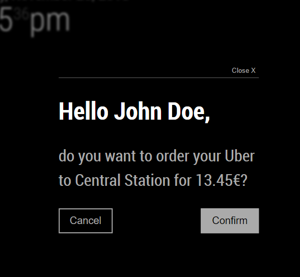

# MMM-Modal Development Documentation

This document describes the way to support your own MagicMirror² module with modal/dialog windows.

## Open a modal

To open a module you need to send a notification.

### Notification

The notification needs to have the name `OPEN_MODAL` and a payload object, that has the structure of the following object:

```js
{
    template: '',
    data: {},
    options: {}
}
```

#### Template Path

The `template` is the path to the nunjuck template of your modal as a string.

If the directory tree looks like this:

```text
MagicMirror
|-modules
  |-YourModule
    |-ModalTemplate.njk
    |-templates
      |-AnotherTemplate.njk
```

Then the template path would look the following way:

```js
{
    template: 'ModalTemplate.njk',
    // ...
}
```

Or for a nested template like this:

```js
{
    template: 'templates/AnotherTemplate.njk',
    // ...
}
```

#### Data

To be able to use some dynamic values in your template you can pass some `data` in the notification. Data should be an object.
Let's assume we have something like:

```js
{
    // ...
    data: {
        myNumber: 11,
        oddArray: [1, 3, 5, 7, 9],
        anObject: {
            myNestedNumber: 19
        }
    }
}
``` 

#### Options

The modal windows can be customized by you as the developer with the following options:

| **Option** | **Default** | **Description** |
| --- | --- | --- |
| `isDialog` | `false` | This flag will give the user the possibility to act on your modal as a dialog (confirm, cancel) if he has `touch` enabled in his config. Click [here]() for more informations. |
| `callback` | `undefined` | If you need to perform an action after the modal was rendered, you can pass a function as callback. The function will be called with `true` on success and `false` on failure. |

```js
{
    // ...
    options: {
        isDialog: false,
        callback(success) {
            Log.info('Was render of modal successful?', success);
        }
    }
}
```

## Template

There is an outer and inner template. The outer template is provided by `MMM-Modal` and renders the inner template (`your template`).

### Outer template

The outer template is rendering the inner template and looks as follow:

```njk
<div class="modal">
    
        <header>
            <span>{{senderName}}</span>
            
                <button class="btn-close">{{'CLOSE' | translate}}</button>
            
        </header>
    

    

    
        <footer>
            <button class="btn-cancel small">{{'CANCEL' | translate}}</button>
            <button class="btn-confirm small">{{'CONFIRM' | translate}}</button>
        </footer>
    
</div>
```

### Inner template

The inner template is your nunjuck template. Here you can access your `data` with handlebars syntax `{{data.myNumber}}`

## Example

An example notification to open a modal would be sent like that.

```js
this.sendNotification("OPEN_MODAL", {
    template: "MyModal.njk",
    data: {
        name: 'John Doe'
    }
});
```

MyModal.njk would look like:

```njk
<h1 class="bright">Hello {{data.name}}</h1>
```

And this is the expected result.


## Dialogs

An example notification to open a dialog would be sent like that.

```js
this.sendNotification("OPEN_MODAL", {
    template: "MyModal.njk",
    data: {
        name: 'John Doe',
        destination: 'Central Station',
        costs: 13.45,
        currency: '€'
    },
    options: {
    	isDialog: true
    }
});
```

MyModal.njk would look like:

```njk
<h2 class="bright">Hello {{data.name}},</h2>
<p>do you want to order your Uber to {{data.destination}} for {{data.costs}}{{data.currency}}?</p>
```

And this is the expected result.


### Closing Dialog

If the user is tapping close, does the same action via voice or the non touch timer runs out, then `MMM-Modal` sends a notification `MODAL_CLOSED` with the payload

```js
{
    identifier: 'module_2_YourModule',
    confirmed: false
}
```

### Canceling Dialog

If the user is tapping cancel or does the same action via voice, then `MMM-Modal` sends a notification `MODAL_CLOSED` with the payload

```js
{
    identifier: 'module_2_YourModule',
    confirmed: false
}
```

### Confirming Dialog

If the user is tapping confirm or does the same action via voice, then `MMM-Modal` sends a notification `MODAL_CLOSED` with the payload

```js
{
    identifier: 'module_2_YourModule',
    confirmed: true
}
```

## Restrictions

Currently, it is not possible to use the nunjuck filters of your module for the modals.
In order to achieve something similar, you can pass the filters as js functions inside the data object and use it in the
modal nunjuck template. Check the list below and see how other developers integrated it in their modules.

## Module List

Once you successfully integrated your module with MMM-Modal, don't forget to add it to the [list](https://github.com/fewieden/MMM-Modal/wiki/Depending-Modules).
